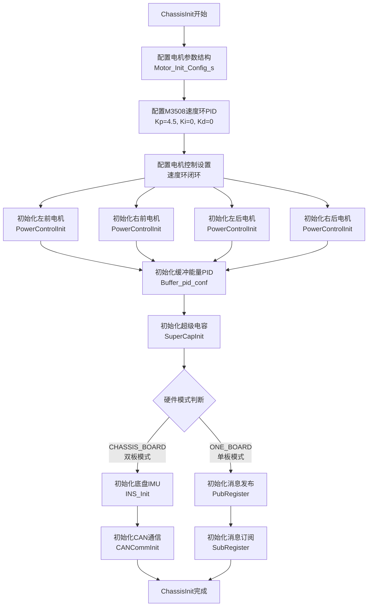
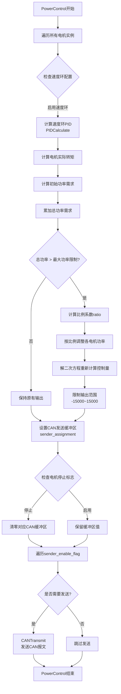
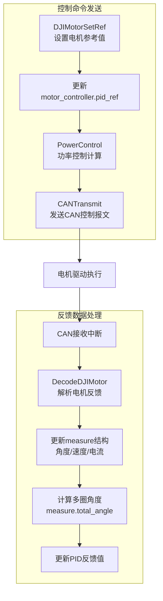
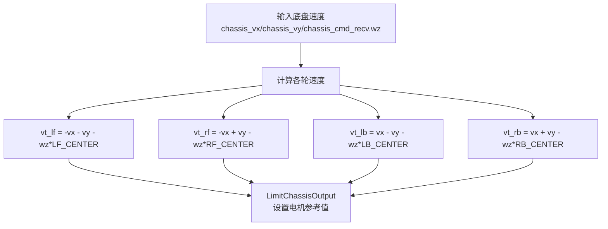
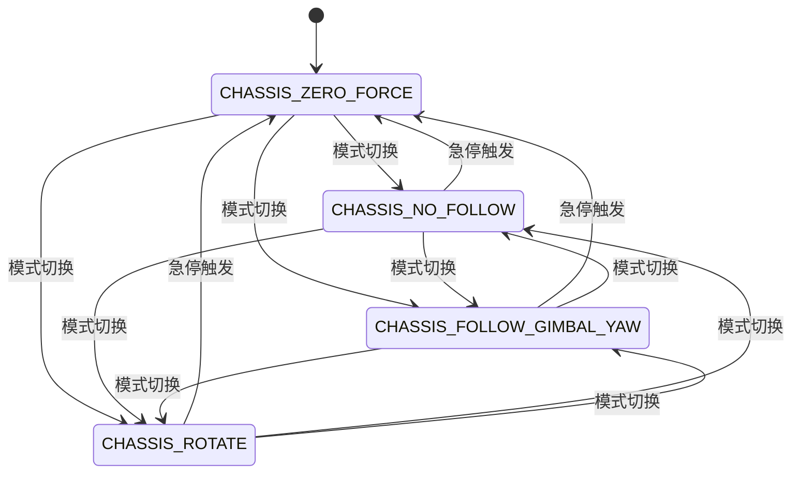
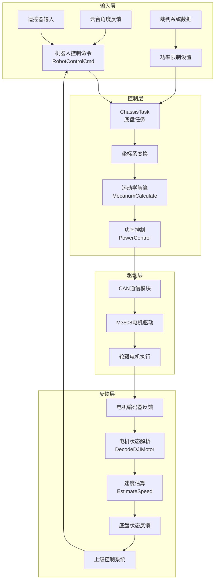
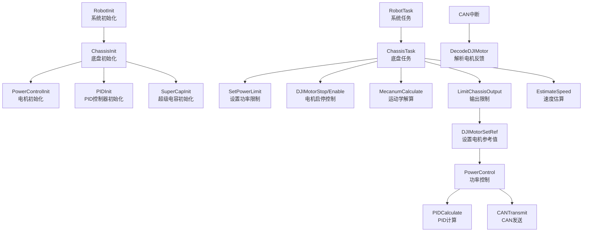

# 底盘控制程序流程图

## 1. 总览流程图

```mermaid
flowchart TD
    subgraph 初始化阶段
        A[系统启动] --> B[ChassisInit
底盘初始化]
        B --> C[初始化M3508电机
PowerControlInit]
        C --> D[初始化PID参数和控制器]
        D --> E[初始化通信系统
Pub/Sub或CAN]
        E --> F[初始化超级电容和裁判系统]
    end
    
    subgraph 运行时阶段
        G[系统启动完成] --> H[ChassisTask
周期性执行]
        H --> I[获取控制命令
chassis_cmd_recv]
        I --> J[设置功率限制
SetPowerLimit]
        J --> K{检查控制模式}
        
        K -->|CHASSIS_ZERO_FORCE| L[停止所有电机
DJIMotorStop]
        K -->|其他模式| M[启用所有电机
DJIMotorEnable]
        
        M --> N{设置旋转速度wz}
        N -->|CHASSIS_NO_FOLLOW| O[wz = 0]
        N -->|CHASSIS_FOLLOW_GIMBAL_YAW| P[wz = f(offset_angle)]
        N -->|CHASSIS_ROTATE| Q[wz = 4000]
        
        O --> R[坐标系变换
计算chassis_vx/vy]
        P --> R
        Q --> R
        
        R --> S[运动学解算
MecanumCalculate]
        S --> T[功率限制和输出
LimitChassisOutput]
        T --> U[电机参考值设置
DJIMotorSetRef]
        U --> V[PowerControl
功率控制和CAN发送]
        
        V --> W[EstimateSpeed
速度估算]
        W --> X[推送反馈数据
PubPushMessage/CANCommSend]
        X --> H
    end
    
    F --> G
    L --> X
```

## 2. 底盘初始化详细流程图



## 3. ChassisTask运行时详细流程图

```mermaid
flowchart TD
    A[ChassisTask开始] --> B{获取控制命令}
    B -->|ONE_BOARD| C[SubGetMessage
获取chassis_cmd_recv]
    B -->|CHASSIS_BOARD| D[CANCommGet
获取chassis_cmd_recv]
    
    C --> E[SetPowerLimit
设置功率限制]
    D --> E
    
    E --> F{chassis_mode判断}
    F -->|CHASSIS_ZERO_FORCE| G[停止四个轮毂电机]
    F -->|其他模式| H[启用四个轮毂电机]
    
    G --> P[推送反馈数据]
    
    H --> I{chassis_mode判断}
    I -->|CHASSIS_NO_FOLLOW| J[wz = 0]
    I -->|CHASSIS_FOLLOW_GIMBAL_YAW| K[wz = -1.5f * offset_angle * abs(offset_angle)]
    I -->|CHASSIS_ROTATE| L[wz = 4000]
    
    J --> M[坐标系变换
根据offset_angle计算vx/vy]
    K --> M
    L --> M
    
    M --> N[MecanumCalculate
计算各轮速度vt_lf/vt_rf/vt_lb/vt_rb]
    N --> O[LimitChassisOutput
设置电机参考值]
    
    O --> Q[EstimateSpeed
速度估算]
    Q --> P
    P --> A
```

## 4. PowerControl功率控制流程图



## 5. 电机控制与反馈流程图



## 6. 底盘坐标系变换流程图

```mermaid
flowchart TD
    A[输入控制命令
chassis_cmd_recv.vx/vy] --> B[计算cos_theta
cos(offset_angle*DEGREE_2_RAD)]
    A --> C[计算sin_theta
sin(offset_angle*DEGREE_2_RAD)]
    
    B --> D[chassis_vx = vx*cos_theta - vy*sin_theta]
    C --> E[chassis_vy = vx*sin_theta + vy*cos_theta]
    
    D --> F[运动学解算输入]
    E --> F
```

## 7. 麦轮运动学解算流程图



## 8. 控制模式状态转换图



## 9. 完整数据流程图



## 10. 关键函数调用关系图

