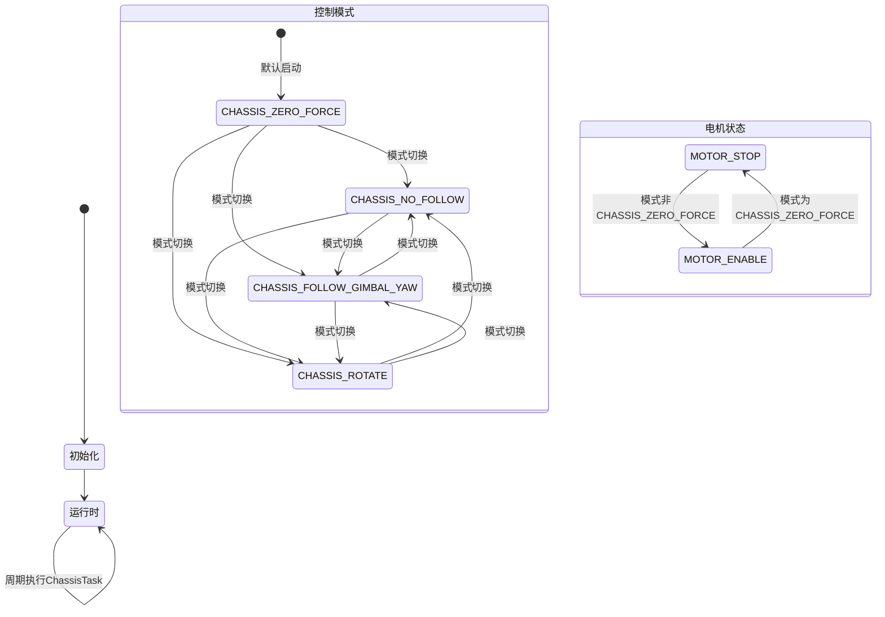
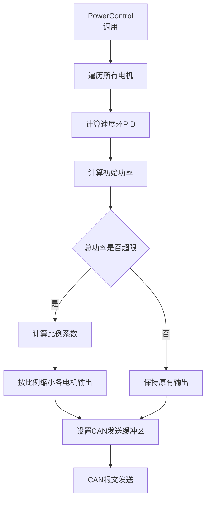
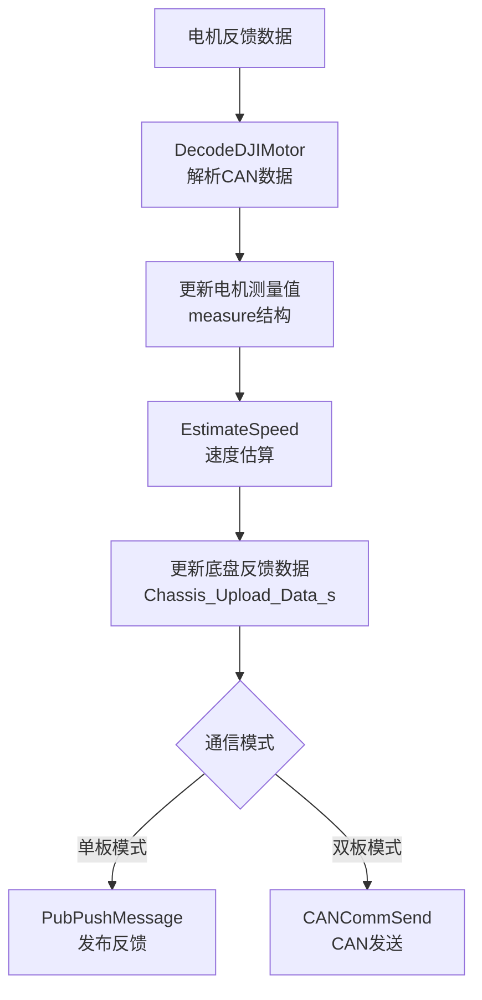
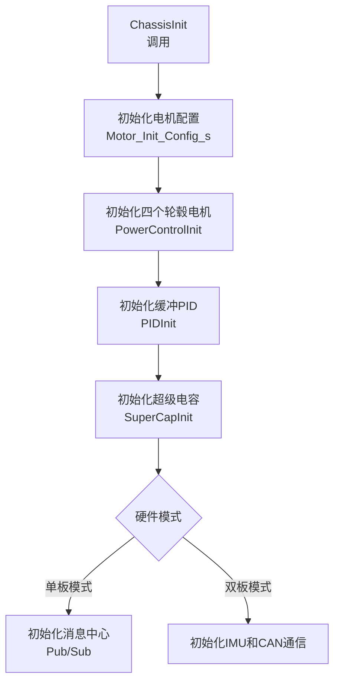
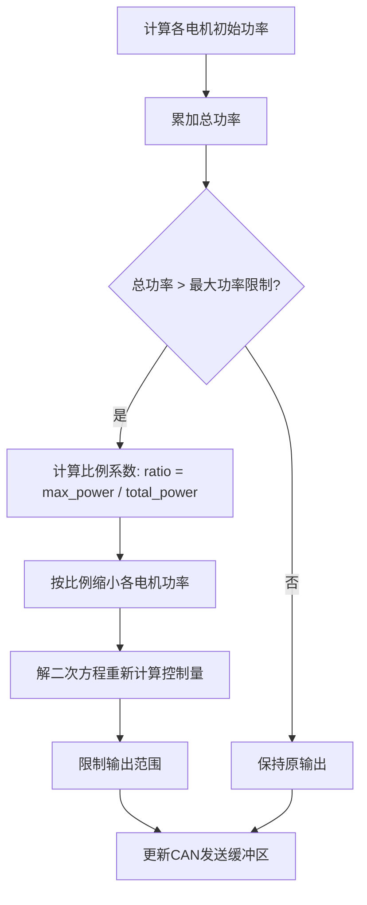

# 底盘控制状态转换与数据流向

## 1. 状态转换流程



## 2. 详细数据流向

### 2.1 控制命令流

```mermaid
flowchart TD
    A[控制命令输入
Chassis_Ctrl_Cmd_s] --> B{检查控制模式}
    B -->|CHASSIS_ZERO_FORCE| C[电机停止
DJIMotorStop]
    B -->|其他模式| D[启用电机
DJIMotorEnable]
    D --> E{设置旋转速度}
    E -->|CHASSIS_NO_FOLLOW| F[wz = 0]
    E -->|CHASSIS_FOLLOW_GIMBAL_YAW| G[wz = f(offset_angle)]
    E -->|CHASSIS_ROTATE| H[wz = 定值]
    F --> I[坐标系变换]
    G --> I
    H --> I
    I --> J[运动学解算
MecanumCalculate]
    J --> K[功率限制和输出
LimitChassisOutput]
    K --> L[电机参考值设置
DJIMotorSetRef]
```

### 2.2 功率控制流



### 2.3 反馈数据流



## 3. 关键数据结构流向

### 3.1 Chassis_Ctrl_Cmd_s 流向
- **来源**：消息中心订阅（单板）或CAN接收（双板）
- **处理**：在ChassisTask中处理，更新vx, vy, wz
- **去向**：用于MecanumCalculate()的运动学解算

### 3.2 电机控制数据流向
- **从底盘到电机**：
  - ChassisTask() → LimitChassisOutput() → DJIMotorSetRef() → PowerControl() → CAN发送

- **从电机到底盘**：
  - CAN接收 → DecodeDJIMotor() → measure结构更新 → EstimateSpeed()

### 3.3 PID控制数据流
- **输入**：电机参考值、电机反馈值
- **处理**：PIDCalculate()计算控制量
- **输出**：电流控制值，通过CAN发送给电机

## 4. 初始化数据流



## 5. 模式转换详细逻辑

| 控制模式 | wz计算方式 | 电机状态 | 适用场景 |
|---------|-----------|---------|----------|
| CHASSIS_ZERO_FORCE | 不计算，电机停止 | 停止 | 急停、重要模块离线 |
| CHASSIS_NO_FOLLOW | wz = 0 | 启用 | 调整云台姿态，底盘不旋转 |
| CHASSIS_FOLLOW_GIMBAL_YAW | wz = -1.5f * offset_angle * abs(offset_angle) | 启用 | 底盘跟随云台旋转 |
| CHASSIS_ROTATE | wz = 4000 | 启用 | 底盘自旋，保持全向机动 |

## 6. 功率限制算法流程

