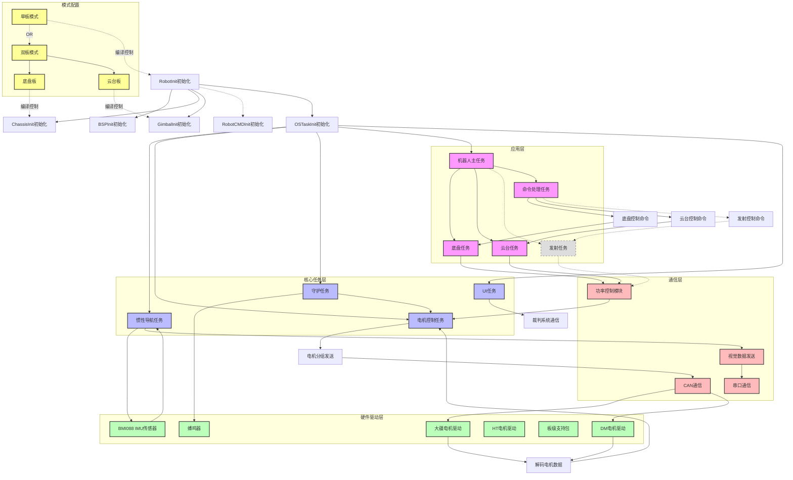
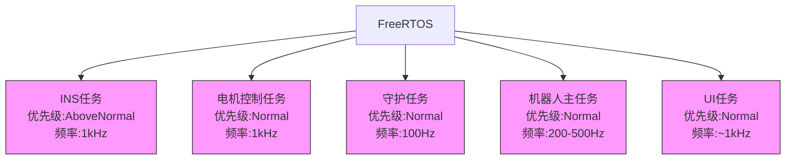
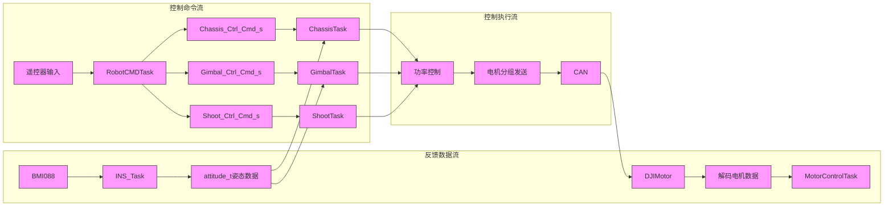
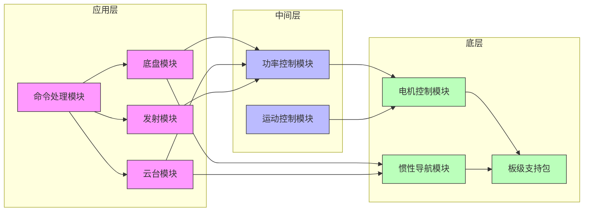
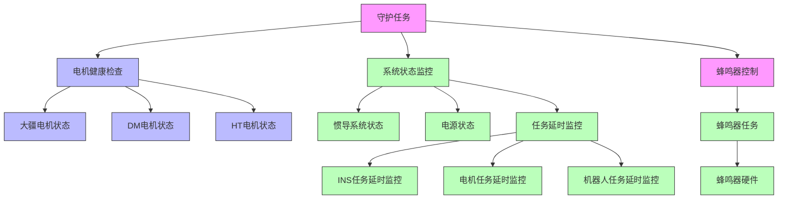

# 机器人各模块交互拓扑图

本文档使用Mermaid语法详细描述机器人系统中各模块之间的交互关系、数据流向和通信机制。拓扑图基于实际代码分析，覆盖了系统的主要组件和它们之间的依赖关系。

## 1. 系统整体架构拓扑图

## 2. 任务调度与优先级关系

## 3. 数据流向图

## 4. 模块职责与依赖关系

## 5. 配置与参数依赖关系

```mermaid
graph TD
    robot_def[robot_def.h] --> RobotTask[机器人任务]
    robot_def --> ChassisTask[底盘任务]
    robot_def --> GimbalTask[云台任务]
    robot_def --> ShootTask[发射任务]
    
    robot_def --> Chassis_Ctrl_Cmd[底盘控制命令]
    robot_def --> Gimbal_Ctrl_Cmd[云台控制命令]
    robot_def --> Shoot_Ctrl_Cmd[发射控制命令]
    
    robot_def --> Chassis_Upload_Data[底盘上传数据]
    robot_def --> Gimbal_Upload_Data[云台上传数据]
    robot_def --> Shoot_Upload_Data[发射上传数据]
    
    ins_task[ins_task.h] --> INSTask[惯性导航任务]
    motor_task[motor_task.h] --> MotorControlTask[电机控制任务]
    
    classDef config fill:#f9f,stroke:#333,stroke-width:1px;
    classDef task fill:#bbf,stroke:#333,stroke-width:1px;
    classDef data fill:#bfb,stroke:#333,stroke-width:1px;
    
    class robot_def,ins_task,motor_task config;
    class RobotTask,ChassisTask,GimbalTask,ShootTask,INSTask,MotorControlTask task;
    class Chassis_Ctrl_Cmd,Gimbal_Ctrl_Cmd,Shoot_Ctrl_Cmd,Chassis_Upload_Data,Gimbal_Upload_Data,Shoot_Upload_Data data;
```

## 6. 守护线程与系统监控拓扑图

## 主要模块说明

1. **应用层模块**：
   - 底盘模块(Chassis)：负责底盘运动控制，支持零力模式、旋转模式、不跟随模式和跟随云台模式
   - 云台模块(Gimbal)：负责云台姿态控制，支持零力模式、自由模式和陀螺仪反馈模式
   - 发射模块(Shoot)：负责发射系统控制（当前代码中被注释禁用）
   - 命令处理模块(RobotCMD)：处理遥控器输入并生成各模块的控制命令

2. **核心任务层**：
   - 惯性导航任务(INSTask)：以1kHz频率运行，处理IMU数据，进行姿态解算，优先级较高
   - 电机控制任务(MotorControlTask)：以1kHz频率运行，控制各类型电机，处理电机反馈
   - 守护任务(DaemonTask)：以100Hz频率运行，监控系统状态和电机健康
   - 机器人主任务(RobotTask)：以200-500Hz频率运行，协调调用各应用层任务
   - UI任务(UITask)：处理用户界面和裁判系统通信

3. **硬件驱动层**：
   - BMI088 IMU传感器：提供加速度和角速度数据，用于姿态解算
   - 电机驱动：包括大疆电机、DM电机和HT电机驱动，通过CAN总线通信
   - 板级支持包(BSP)：提供底层硬件抽象，包括ADC、CAN、GPIO等驱动
   - 蜂鸣器：用于系统状态提示和警报

4. **通信层**：
   - CAN通信：用于电机控制命令发送和反馈数据接收
   - 串口通信：用于调试信息输出和视觉数据传输
   - 功率控制模块：实现功率限制算法，确保系统安全运行

5. **配置模式**：
   - 单板模式：所有功能在一个控制板上实现
   - 双板模式：分为底盘板和云台板，通过通信协议协同工作

通过这个拓扑图，可以清晰地了解机器人系统中各模块的组织结构、任务优先级、数据流向以及依赖关系，有助于系统的维护、调试和开发。拓扑图中虚线表示当前代码中被注释禁用的功能，实线表示活跃的功能模块。