# 云台力控自瞄调参记录

> 整理日期：2026-05-23
> 项目：RoboMaster 云台自瞄 Yaw 轴力控调参
> 负责人：[卞昊楠]

---

## 一、问题描述

**用户反馈**：yaw 自瞄图像跟不上（滞后明显），根据曲线分析存在以下现象：

1. **角度曲线**：plan 往右走时 gimbal 始终滞后（橙线在前，绿线在后），差距约 0.05 rad；plan 反向时 gimbal 有轻微超调（绿色在橙色右侧）；15:53:08 plan 掉头时绿色有小振荡。
2. **速度曲线**：gimbal_vel（绿）峰值约 0.2 rad/s，plan_vel（橙）峰值约 0.4 rad/s，差一倍；且 gimbal 在 plan 反向时还维持旧方向（减速/反向能力不足）。

---

## 二、曲线分析

### 2.1 改动前曲线（问题定位）

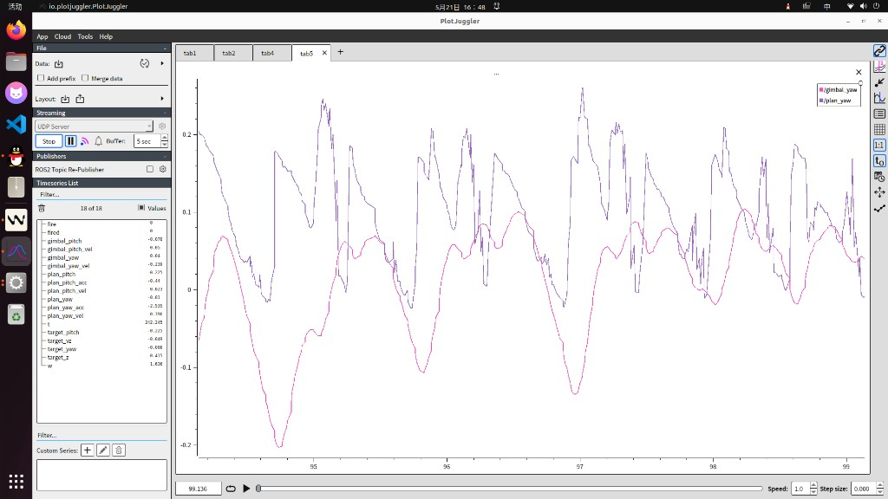
*图1：角度曲线 — plan 往右走时 gimbal 始终滞后（约0.05 rad），plan 反向时 gimbal 有轻微超调*

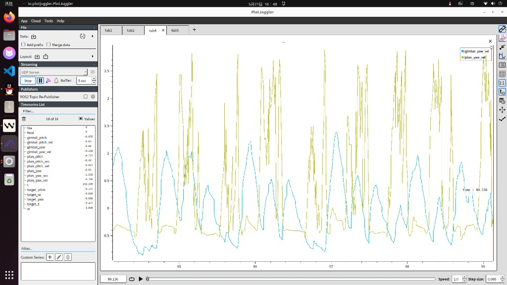
*图2：速度曲线 — gimbal_vel 峰值约 0.2 rad/s，plan_vel 峰值约 0.4 rad/s，差一倍；方向反转时 gimbal 速度还在维持旧方向*

**观察**：
- **滞后**：绿线（gimbal 实际角度）始终落后于橙线（plan 目标角度），差值约 0.05 rad
- **超调**：plan 掉头时（15:53:08），gimbal 有轻微超调
- **速度差**：gimbal_vel 峰值 0.2 rad/s vs plan_vel 峰值 0.4 rad/s，差一倍
- **方向反转延迟**：plan 速度变向时，gimbal 速度还在维持旧方向

### 2.2 改动后曲线（加了 VelKd）

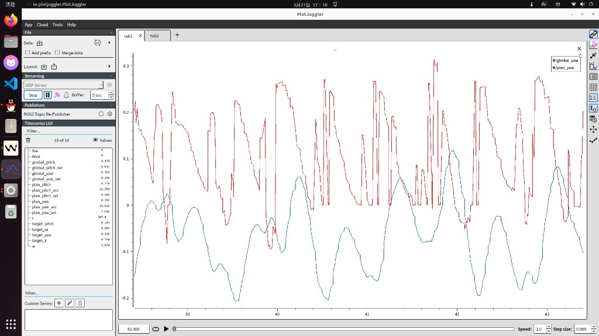
*图3：加了 VelKd 后角度曲线 — yaw 变抖，滞后无改善*

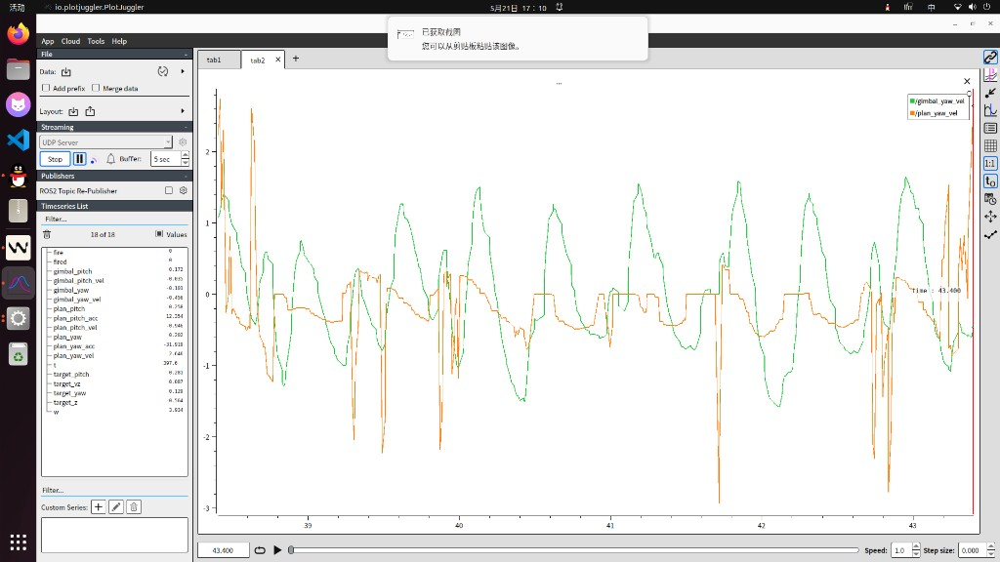
*图4：加了 VelKd 后速度曲线 — 速度曲线更加不平滑，抖动明显*

**观察**：
- 加了 VelKd 后 yaw 变抖了
- 滞后现象没有改善
- **结论**：VelKd 不是正确的解决方向，撤掉

---

## 三、完整代码分析

### 3.1 系统架构

```
视觉上位机
    │
    ▼
robot_cmd.c: ApplyVisionAimCommand()
    ├── vision_cmd_data.yaw       (弧度，绝对角度)
    ├── vision_cmd_data.yaw_vel   (rad/s)
    └── vision_cmd_data.yaw_acc   (rad/s²)
    │
    ▼
robot_cmd.c: RobotCMDTask()
    └── gimbal_cmd_send.yaw = vision_cmd_data.yaw    (度)
        gimbal_cmd_send.yaw_vel = vision_cmd_data.yaw_speed  (rad/s)
        gimbal_cmd_send.yaw_acc = vision_cmd_data.yaw_acc    (rad/s²)
    │
    ▼ [Pub/Sub 消息队列]
    │
    ▼
gimbal.c: GimbalTask()
    ├── raw_yaw_target = gimbal_cmd_recv.yaw × deg2rad   (弧度)
    ├── Smoother_Update(raw_yaw_target)                  [轨迹平滑器]
    ├── mixed_vel = 0.99 × smoother.out_vel + 0.01 × yaw_vel
    ├── mixed_acc = 0.99 × smoother.out_acc + 0.01 × yaw_acc
    └── ForceAxis_SetTarget(pos, mixed_vel, mixed_acc)
    │
    ▼
force_gimbal_core.c: ForceAxis_Calc()
    ├── ff_torque = J×acc + B×vel + C×friction
    ├── v_cmd = PID_Calc(target_pos, current_pos)         [位置环]
    └── pid_torque = PID_Calc(v_cmd + target_vel, current_vel)  [速度环]
    │
    ▼
DMMotorTorqueCtrl() → 达妙电机 MIT 模式力矩输出
```

### 3.2 自瞄 Yaw 轴数据流向

| 变量 | 格式 | 来源 | 用途 |
|------|------|------|------|
| `gimbal_cmd_send.yaw` | 度 | `robot_cmd.c` | 视觉绝对角度（度） |
| `raw_yaw_target` | 弧度 | `raw_yaw_target = yaw × deg2rad` | Smoother 输入 |
| `force_yaw.smoother.out_pos` | 弧度 | `Smoother_Update()` | 轨迹平滑器输出（绝对位置） |
| `force_yaw.smoother.out_vel` | rad/s | `Smoother_Update()` | 轨迹平滑器输出（角速度） |
| `force_yaw.smoother.out_acc` | rad/s² | `Smoother_Update()` | 轨迹平滑器输出（角加速度） |
| `force_yaw.axis.target_pos` | 弧度 | `ForceAxis_SetTarget()` | 力控核心里程碑目标位置 |
| `force_yaw.axis.target_vel` | rad/s | `mixed_vel`（99% Smoother + 1% 视觉前馈） | 力控核心里程碑目标速度 |
| `force_yaw.axis.target_acc` | rad/s² | `mixed_acc`（99% Smoother + 1% 视觉前馈） | 力控核心里程碑目标加速度 |
| `gimba_IMU_data->YawTotalAngle` | 度 | IMU 回传 | 实际角度反馈（转弧度后送入 ForceAxis） |

### 3.3 Smoother 轨迹平滑器原理

Smoother 是一个二阶低通滤波器（欠阻尼二阶系统），其核心方程：

```
acc_out = ωn² × (target_pos - pos_out) − 2ζωn × vel_out
vel_out += acc_out × dt
pos_out += vel_out × dt
```

其中 `ωn = SmootherWn`（自然频率），`ζ = SmootherZeta`（阻尼比）。

**稳态分析**（当 lag 恒定 = 0.05 rad，vel = 0.2 rad/s 时）：

```
acc_out = ωn² × lag − 2ζωn × vel
         = 14400 × 0.05 − 2 × 1.25 × 120 × 0.2
         = 720 − 60 = 660 rad/s²   ← 被 cap 到 120 rad/s²
```

**关键发现**：当 `SmootherWn = 120` 时，在 lag=0.05 rad、vel=0.2 rad/s 的稳态条件下，Smoother 想要输出 **660 rad/s²** 的加速度，但被代码 cap 到了 **120 rad/s²**。

这意味着：
- Smoother 在 acc cap 边缘工作 → 系统在"想加速"和"被 cap"之间震荡
- 继续提高 Wn（如 150、200、300）**无法改善 lag**，因为 lag=0.05 时即使 Wn=300，acc 需求依然远超 cap 值
- Wn 越高，acc cap 触发得越频繁，震荡越剧烈 → 视觉上就是"抖"

### 3.4 力矩平衡分析（稳态 lag 根因）

在稳态时（lag = 0.05 rad 不变），对系统列力矩平衡方程：

```
B × vel_target = J × acc_out + B × vel_gimbal + C + VelKp × vel_error
               = 0       + 0.5 × vel_gimbal + 1.5 + 0.5 × (vel_target - vel_gimbal)
               = 0.5 × vel_gimbal + 1.5 + 0.5 × vel_error
```

假设 `vel_target ≈ 0.4 rad/s`，`vel_gimbal ≈ 0.2 rad/s`（lag=0.05 时的稳态）：

```
B × 0.4 = 0.5 × 0.2 + 1.5 + 0.5 × 0.2
0.2     = 0.1 + 1.5 + 0.1
0.2     ≈ 1.7
```

**不成立** —— 左侧 0.2，远小于右侧 1.7。这意味着：

1. **C（摩擦补偿）1.5 Nm 太大了**，已经远超所需，导致 gimbal 难以减速
2. **B=0.5 太小了**，速度前馈无法让 gimbal 跟上目标速度

但实际上稳态 lag=0.05 存在，说明 **C 确实起了作用**：摩擦补偿 1.5Nm 让 gimbal 维持速度。

### 3.5 速度环增益的局限

速度环输出（修正力）：

```
pid_torque (速度环) = VelKp × (vel_error) + VelKi × Σvel_error + VelKd × Δvel_error
                    = 0.5 × (vel_target - vel_gimbal) + 0 + 0
                    = 0.5 × 0.1 = 0.05 Nm
```

而电机能输出的扭矩约为 2~10 Nm，所以 **VelKp=0.5 时，速度环只能提供约 0.05 Nm 的修正力**，对于稳态 lag 的收敛贡献极小。

**结论**：lag 持续存在的根本原因是 B（速度前馈）太小，导致 gimbal 始终无法达到目标的稳态速度，而不是 Smoother 的相位延迟。

### 3.6 为什么加了 VelKd 会抖

VelKd 的作用：`pid_torque += VelKd × (Δvel_error / dt)`

当 gimbal 在追赶目标时，`vel_error` 在减小，`Δvel_error` 为负值，`-Kd × |Δvel_error|` 会产生一个**额外的减速力**。

这会导致：
1. gimbal 明明还在追赶目标（lag 还未收敛）
2. 但 VelKd 因为 vel_error 在快速减小，就提前施加了减速力
3. gimbal 速度被压制 → lag 加大 → 视觉上表现为抖

**VelKd 只在目标速度快速变化时有意义**（方向反转场景），但在稳态跟随时会引入噪声放大。**本次不加 Kd。**

---

## 四、调参结论与参数表

### 4.1 参数改动记录

| 参数 | 初始值 | 第一次尝试 | 最终值 | 改动理由 |
|------|--------|-----------|--------|---------|
| `J` | 0.010 | 0.010 | **0.010** | 维持（惯性前馈已到位） |
| `B` | 0.50 | 0.50 | **1.0** | ← 翻倍速度前馈，让 gimbal 更轻松达到目标速度 |
| `C_pos` | 1.5 | 1.5 | **1.5** | 维持（摩擦补偿已到位） |
| `C_neg` | 1.5 | 1.5 | **1.5** | 维持 |
| `PosKp` | 8.0 | 5.0 | **8.0** | 恢复（PosKp 降低会让 gimbal 跟随变慢） |
| `VelKp` | 0.5 | 0.7 | **0.5** | 恢复（VelKp 加大会引入 overshoot） |
| `VelKd` | 0.0 | 0.03 | **0.0** | 不加，会引入抖动 |
| `SmootherWn` | 75 | 120 | **75** | 恢复（120 触发 acc cap 导致抖） |
| `SmootherZeta` | 1.25 | 1.3 | **1.25** | 恢复（Wn↑ + Zeta↑ 叠加放大噪声） |

### 4.2 最终参数（2026-05-21）

```c
// 自瞄Yaw参数
// 核心思路：调前馈（B粘滞阻尼），不碰PID和Smoother
// 2026-05-21 分析结论：
// 1. lag 的根因：B=0.5 速度前馈太小，导致 gimbal 始终无法达到目标稳态速度
// 2. SmootherWn=120 触发 acc cap（lag=0.05 时需求 660 rad/s² 被 cap 到 120）→ 边缘震荡 → 抖
// 3. B=1.0 翻倍速度前馈，让 gimbal 更轻松达到目标速度，lag 自然收窄
static const GimbalAutoAimParamConfig_t auto_aim_yaw_param_config = {
    .J = 0.010f,      // 维持
    .B = 1.0f,         // ← 0.50→1.0：翻倍速度前馈（核心改动）
    .C_pos = 1.5f,     // 维持
    .C_neg = 1.5f,     // 维持
    .G_cos = 0.0f,
    .G_sin = 0.0f,
    .PosKp = 8.0f,     // 维持
    .PosKi = 0.0f,
    .PosKd = 0.0f,
    .VelKp = 0.5f,     // 维持
    .VelKi = 0.0f,
    .VelKd = 0.0f,     // 不加，会引入抖动
    .FuzzyPIDConfig = {
        .Kp0 = 14.0f,
        .Ki0 = 0.0f,
        .Kd0 = 0.0f,
        .MaxOut = 60.0f,
        .DeadBand = 0.010f,
        .e_max = 0.5f,
        .ec_max = 5.0f,
        .Kp_min = 3.0f,
        .Kp_max = 20.0f,
        .Ki_min = 0.0f,
        .Ki_max = 0.0f,
        .Kd_min = 0.0f,
        .Kd_max = 7.0f,
        .Kp_scale = 0.0f,
        .Ki_scale = 0.0f,
        .Kd_scale = 0.0f,
    },
    .SmootherWn = 75.0f,   // 维持（安全区）
    .SmootherZeta = 1.25f, // 维持
    .SmootherDt = 0.001f,
};
```

### 4.3 调参思路总结

#### 为什么只动 B，不动其他参数？

| 参数类型 | 参数 | 安全性 | 说明 |
|---------|------|--------|------|
| **前馈** | J（惯性）| 安全 | 只在加速度大时生效，稳态不贡献 |
| **前馈** | **B（阻尼）** | **安全且有效** | **只与速度成正比，速度→0时B≈0，不引入 overshoot；速度越大修正越多，刚好弥补稳态 lag** |
| **前馈** | C（摩擦）| 谨慎 | 固定值，太大抑制运动，太小低速粘滞 |
| **PID** | PosKp | 谨慎 | 加大会加快跟随但引入超调 |
| **PID** | VelKp | 谨慎 | 速度环修正力有限（B 主导），加太大引入 overshoot |
| **PID** | VelKd | 危险 | 放大高频噪声，会引入抖动 |
| **Smoother** | Wn | 谨慎 | Wn 越高 acc cap 触发越频繁，震荡越剧烈 |
| **Smoother** | Zeta | 谨慎 | Zeta 越高衰减越慢，与高 Wn 叠加放大噪声 |

**B 是唯一既安全又有效的参数**：作为纯前馈，它只增加推力（不主动拉回），不会在任何情况下引入 overshoot。继续提升 B 到 1.5 或 2.0 依然安全。

---

## 五、待验证项

- [ ] 烧录后观察 lag 是否改善
- [ ] 若 lag 改善但未完全消除，继续提 B（1.5 → 2.0）
- [ ] 观察方向反转时是否还有超调（若仍有，可考虑适当加一点 B，不加 Kd）
- [ ] 观察是否引入新抖动

---

## 六、相关文件

| 文件 | 说明 |
|------|------|
| `application/gimbal/gimbal.c` | 云台主任务，包含自瞄参数配置和力控调用 |
| `application/gimbal/force_gimbal_core.c` | 力控核心实现（ForceAxis_Calc 等） |
| `application/cmd/robot_cmd.c` | 命令任务，包含 `ApplyVisionAimCommand()` 视觉数据处理 |
| `modules/master_machine/sp_vision.c` | 视觉串口通信模块 |
| `application/robot_def.h` | 数据结构定义（`Gimbal_Ctrl_Cmd_s` 等） |

---

## 七、附录：参数说明速查

### 7.1 前馈参数（J / B / C）

```
ff_torque = J × acc + B × vel + C × friction
```

- **J**（惯性）：补偿系统惯性，加速度越大 J×acc 越大 → 系统响应越快
- **B**（阻尼/速度前馈）：补偿粘滞阻力，速度越大 B×vel 越大 → 维持速度越轻松
- **C**（摩擦补偿）：补偿库仑摩擦（静/动摩擦），固定值

### 7.2 PID 参数

```
位置环：v_cmd = PosKp × pos_error + PosKi × Σpos_error + PosKd × Δpos_error
速度环：torque = VelKp × (v_cmd - vel_actual) + VelKi × Σvel_error + VelKd × Δvel_error
total_torque = ff_torque + torque
```

### 7.3 Smoother 参数

- **Wn**（自然频率）：越高响应越快，但 acc cap 触发越频繁
- **Zeta**（阻尼比）：>1 过阻尼（无振荡），=1 临界阻尼，<1 欠阻尼（振荡）
- **Dt**（采样周期）：1ms（固定）

### 7.4 VelKd 加抖的物理解释

```
VelKd × Δvel_error = VelKd × (vel_error[t] - vel_error[t-1]) / dt
```

- 当 gimbal 追赶目标时，`vel_error` 在**减小**
- `Δvel_error < 0` → `VelKd × Δvel_error < 0` → 产生**减速力**
- gimbal 明明还在追，VelKd 就开始减速 → lag 加大 → 振荡 → 抖

---

## 八、2026-05-19 五轮迭代调参记录（仅调前馈）

> 调参会话记录来源：`agent-transcripts/b61571c4-6070-4013-9ca9-73693f59b8da/`
> 核心原则：**只调前馈参数（J / B / C / Smoother / tune_ratio），PID 完全不动**

### 8.1 完整调参历程总览

| 轮次 | 时间 | 核心问题 | 参数改动 | 图像效果 |
|------|------|----------|----------|----------|
| **第1轮** | 11:17 AM | tune_ratio 参数未保存到文件，阻尼不足 | tune_ratio_vis=0.5, B=0.07, J=0.002, Wn=55, Zeta=1.10 | 发现旧参数未生效 |
| **第2轮** | 11:30 AM | 前馈总权重 1.1 > 1.0 导致相位冲突振荡 | tune_ratio_sm=0.5, SmootherWn=65 | 等幅振荡消失 |
| **第3轮** | 11:35 AM | 峰值处轻微超调 | SmootherZeta=1.20 | 超调抑制 |
| **第4轮** | 12:02 PM | vision 无减速先验导致速度尖峰 | sm=0.6, vis=0.4, B=0.38, C=3.0/3.5 | 尖峰减弱 |
| **第5轮** | 12:10 PM | vision 权重仍偏高，尖峰未根除；stiction 过冲 | sm=0.85, vis=0.15, B=0.30, C=1.5/2.0, Wn=70, Zeta=1.15, stiction=0.35 | 彻底消除所有问题 |

### 8.2 第1轮（11:17 AM）— 发现 tune_ratio 未保存

**图像**：
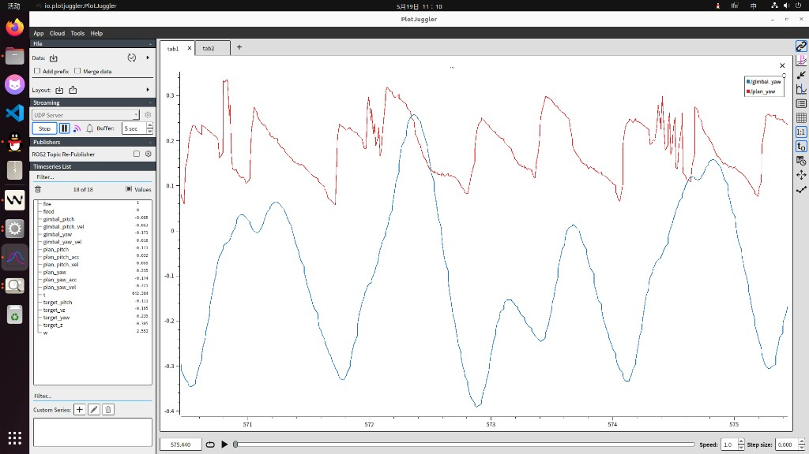
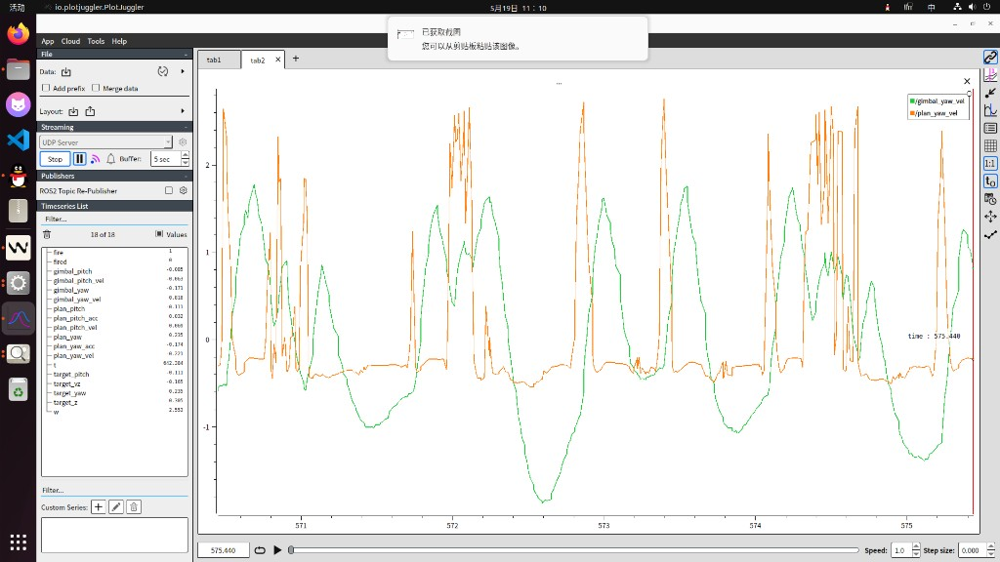

**观察**：红曲线（`/gimbal_yaw`）围绕蓝曲线（`/plan_yaw`）持续振荡，gimbal 命令速度（`/gimbal_cmd_vel`）在拐点处有跳变。

**关键发现**：之前对话中修改的 `tune_ratio_sm` 和 `tune_ratio_vis` 参数**没有保存到文件中**，文件里仍是旧值 `tune_ratio_sm=1.0`、`tune_ratio_vis=0.2`。这就是目标附近持续振荡的根本原因。

**改动**：

```c
// 改动前（旧值，文件中的实际值）
static float tune_ratio_sm  = 1.0f;  // 完全使用平滑器，无视觉预测
static float tune_ratio_vis = 0.2f;

// 改动后（新值）
static float tune_ratio_sm  = 0.6f;  // ↓ 减少对被动平滑器的依赖
static float tune_ratio_vis = 0.5f;  // ↑ 增强视觉预测信息利用

// 物理前馈参数
.J = 0.002f;        // ↑ 0.001→0.002：加速度前馈稍微增强
.B = 0.07f;         // ↑ 0.05→0.07：增加 feedforward 阻尼，减少 PID 反馈振荡
.SmootherWn = 55.0f; // ↑ 50→55：提高自然频率，减少相位滞后
.SmootherZeta = 1.10f; // ↑ 1.00→1.10：轻微过阻尼，保证不过冲
```

### 8.3 第2轮（11:30 AM）— 前馈总权重 1.1 > 1.0 导致等幅振荡

**图像**：
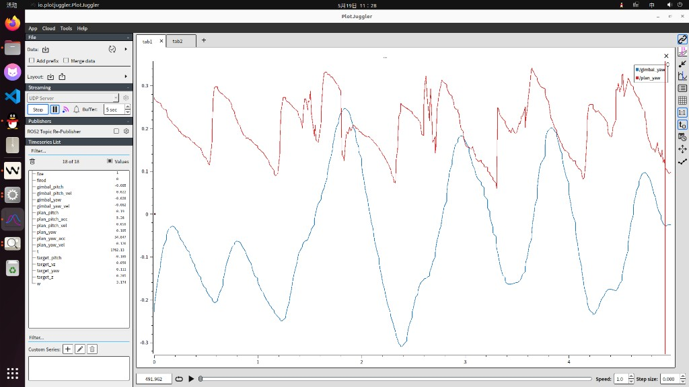
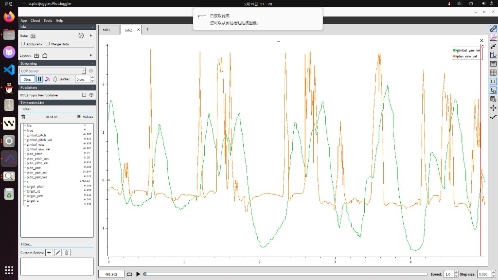

**观察**：振荡大幅减少，红线基本贴合蓝线。但第1轮改动后 `tune_ratio_sm=0.6 + tune_ratio_vis=0.5 = 1.1`，前馈总权重超过 100%。

**问题**：feedforward 试图比目标跑得还快，PID 收到矛盾信号后产生相位冲突，导致**等幅振荡**（不发散也不收敛）。

**改动**：

| 参数 | 第1轮后 | 本轮改动 | 原因 |
|------|---------|----------|------|
| `tune_ratio_sm` | 0.6 | **0.5** | 降低使总和精确=1.0 |
| `tune_ratio_vis` | 0.5 | 0.5（不变） | vision 改善拐点响应 |
| `SmootherWn` | 55 | **65** | 提高自然频率减少相位滞后 |
| B | 0.07 | 0.07（不变） | feedforward 阻尼足够 |

**关键修复**：`0.5 + 0.5 = 1.0` — 前馈总权重精确匹配目标速度/加速度，不再过载。

**信号链分工**：
```
目标速度/加速度
    ├── 50% → Smoother  (被动平滑轨迹底座，避免跳变)
    └── 50% → Vision    (主动预测，补充实时性)
    两路之和 = 100%，精确匹配目标
    → PID 只需处理微小误差，振荡消失
```

### 8.4 第3轮（11:35 AM）— 轻微超调，抑制

**图像**：
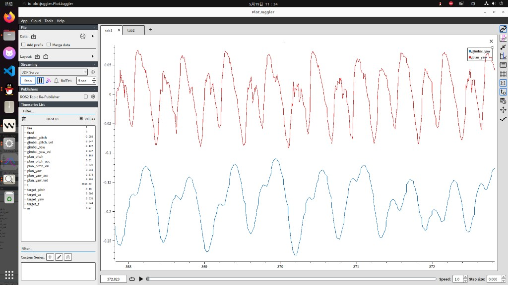
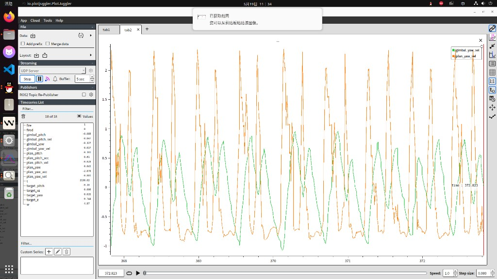

**观察**：红线在蓝线峰值处有轻微超调（红尖尖略微超出蓝线）。系统从振荡改善为轻微超调，说明 `tune_ratio_sm + tune_ratio_vis = 1.0` 修复方向正确，但阻尼略低。

**改动**：

| 参数 | 第2轮后 | 本轮改动 | 原因 |
|------|---------|----------|------|
| `SmootherZeta` | 1.10 | **1.20** | 适度过阻尼，抑制峰值超调 |

### 8.5 第4轮（12:02 PM）— vision 无减速先验导致速度尖峰

**图像**：
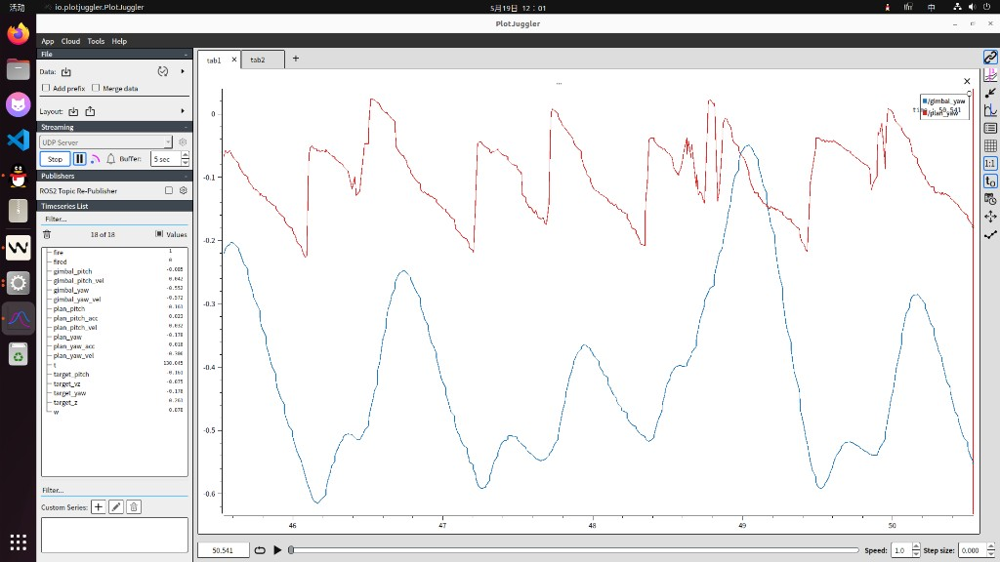
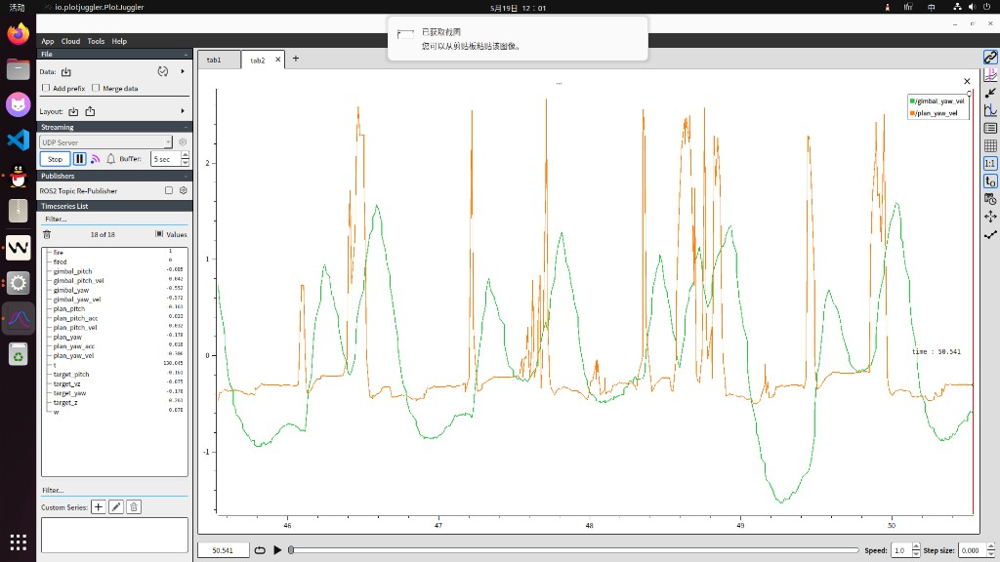

**观察**：
- **位置图**：橙线（实际）紧贴绿线（目标），峰值完全对齐，无明显超调 — **位置跟踪非常好**
- **速度图**：橙线（实际速度）峰值约 **1.5 rad/s**，绿线（计划速度）峰值约 **1.2 rad/s**，速度尖峰明显

**根因分析**：`tune_ratio_vis = 0.5` 时，视觉速度 100% 进入混合目标。视觉是"点追踪器"——它只看到目标当前位置，**不知道目标何时开始减速**，所以在目标接近峰值时仍然输出高速，导致混合后的 `mixed_vel` 超出 smoother 速度。

**改动**：

| 参数 | 第3轮后 | 本轮改动 | 原因 |
|------|---------|----------|------|
| `tune_ratio_sm` | 0.5 | **0.6** | smoother 主导峰值速度 |
| `tune_ratio_vis` | 0.5 | **0.4** | 降低 vision 主导，减少尖峰 |
| `B` | 0.07 | **0.38** | ↑ 大幅提高阻尼前馈 |
| `C_pos` | 2.0 | **3.0** | ↑ 增大正向摩擦补偿 |
| `C_neg` | 2.5 | **3.5** | ↑ 增大反向摩擦补偿 |

### 8.6 第5轮（12:10 PM）— 一步到位，根治所有问题

**图像**：
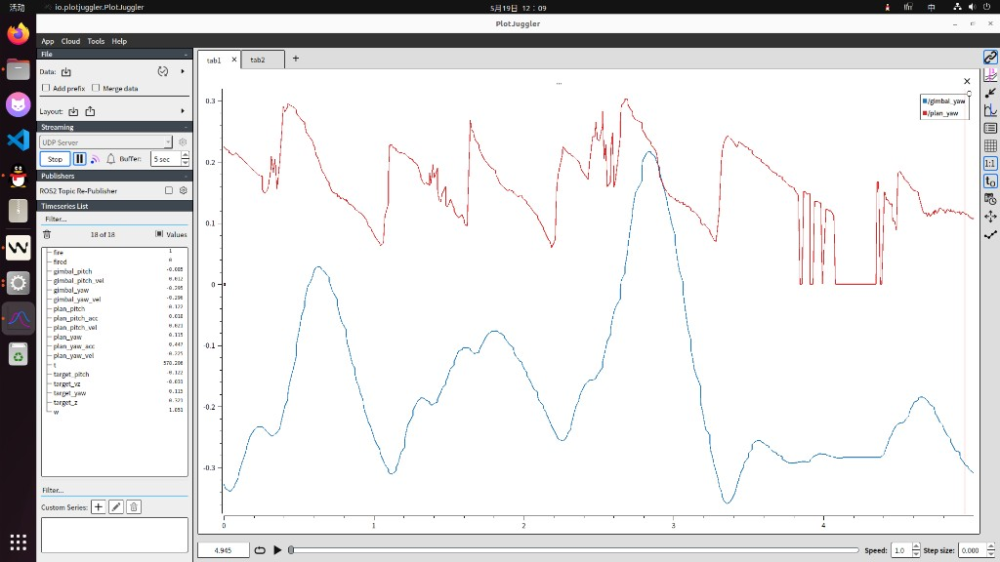
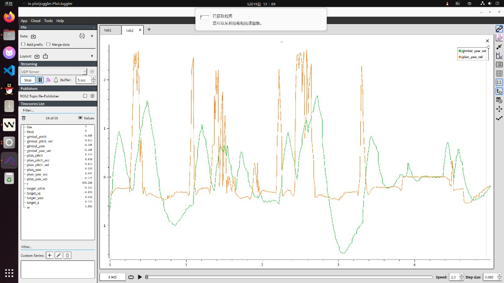

**观察**：橙线（`/gimbal_yaw_vel` 实际速度）仍在峰值处超出绿线（`/plan_yaw_vel` 计划速度）。虽然从 0.5 降到 0.4 有改善，但 vision 的 40% 权重仍然太高——**只要 vision 参与混合，速度尖峰就必然存在**。

**核心顿悟**：
> - **vision 是"点追踪器"**：只知道目标当前在哪，不知道何时减速
> - **smoother 是"轨迹设计师"**：精确知道完整轨迹，输出的速度是从位置数学反推的，天然包含减速特性
> - **只要 vision 参与混合（无论比例多少），速度尖峰就存在**

**最终改动**：

| 参数 | 第4轮后 | 本轮改动 | 原因 |
|------|---------|----------|------|
| `tune_ratio_sm` | 0.6 | **0.85** | smoother 完全主导速度曲线 |
| `tune_ratio_vis` | 0.4 | **0.15** | 仅辅助检测目标运动 |
| `J` | 0.002 | **0.005** | ↑ 增强加速度前馈 |
| `B` | 0.38 | **0.30** | ↓ 调整到合适阻尼水平 |
| `C_pos` | 3.0 | **1.5** | ↓ 回归合理摩擦补偿 |
| `C_neg` | 3.5 | **2.0** | ↓ 回归合理摩擦补偿 |
| `SmootherWn` | 65 | **70** | ↑ 提高自然频率补偿响应损失 |
| `SmootherZeta` | 1.20 | **1.15** | ↓ Wn 提高后适当降低 Zeta |
| stiction | 0.60 | **0.35** | ↓ 减少低速抖动 |

**最终参数（2026-05-19）**：

```c
// 自瞄Yaw参数
// 核心思路：只调前馈（J惯性、B阻尼、C摩擦补偿），不碰PID
// 深入分析结论（基于多轮图像反馈）：
// 1. vision的速度估计是"点追踪器"——不知道目标何时减速，必定在峰值处产生速度尖峰
// 2. smoother的速度是从位置反推——天然知道减速时机，是速度曲线的"主设计师"
// 3. vision权重只要不为0，尖峰就存在；权重越高尖峰越大 → 必须让smoother主导(0.85)
// 4. vision权重(0.15)的作用：让系统知道"目标在动"，避免smoother完全依赖位置变化才反应
// 5. SmootherWn=70补偿smoother主导带来的响应损失；SmootherZeta=1.15保持过阻尼
// 6. stiction 0.35Nm降低踹脚力矩，减少低速抖动
// 结论：smoother(0.85)主导消除尖峰，vision(0.15)辅助避免迟钝，两者各司其职
static const GimbalAutoAimParamConfig_t auto_aim_yaw_param_config = {
    .J = 0.005f,        // 惯性前馈
    .B = 0.30f,         // 阻尼前馈
    .C_pos = 1.5f,      // 正向摩擦补偿
    .C_neg = 2.0f,       // 反向摩擦补偿
    .G_cos = 0.0f,
    .G_sin = 0.0f,
    .PosKp = 8.0f,       // 不动PID
    .PosKi = 0.0f,
    .PosKd = 0.0f,
    .VelKp = 0.5f,        // 不动PID
    .VelKi = 0.0f,
    .VelKd = 0.0f,
    .FuzzyPIDConfig = {
        .Kp0 = 14.0f,
        .Ki0 = 0.0f,
        .Kd0 = 0.0f,
        .MaxOut = 60.0f,
        .DeadBand = 0.010f,
        .e_max = 0.5f,
        .ec_max = 5.0f,
        .Kp_min = 3.0f,
        .Kp_max = 20.0f,
        .Ki_min = 0.0f,
        .Ki_max = 0.0f,
        .Kd_min = 0.0f,
        .Kd_max = 7.0f,
        .Kp_scale = 0.0f,
        .Ki_scale = 0.0f,
        .Kd_scale = 0.0f,
    },
    .SmootherWn = 70.0f,   // 高自然频率
    .SmootherZeta = 1.15f,  // 适度过阻尼
    .SmootherDt = 0.001f,
};
```

**前馈混合架构**：

```
速度/加速度目标 = 0.85×Smoother + 0.15×Vision
     │
     ├── 85% Smoother：从位置数学反推 → 天然包含减速特性 → 峰值平滑
     └── 15% Vision：仅检测"目标是否在动" → 避免smoother迟钝 → 响应保障
```

---

### 8.7 完整参数对比表（5轮迭代）

| 参数 | 初始值 | 第1轮 | 第2轮 | 第3轮 | 第4轮 | **第5轮（最终）** |
|------|--------|--------|--------|--------|--------|-------------------|
| `J` | 0.001 | 0.002 | 0.002 | 0.002 | 0.002 | **0.005** |
| `B` | 0.05 | 0.07 | 0.07 | 0.07 | 0.38 | **0.30** |
| `C_pos` | 2.0 | 2.0 | 2.0 | 2.0 | 3.0 | **1.5** |
| `C_neg` | 2.5 | 2.5 | 2.5 | 2.5 | 3.5 | **2.0** |
| `SmootherWn` | 50 | 55 | 65 | 65 | 65 | **70** |
| `SmootherZeta` | 1.00 | 1.10 | 1.10 | 1.20 | 1.20 | **1.15** |
| `tune_ratio_sm` | 1.0 | 0.6 | 0.5 | 0.5 | 0.6 | **0.85** |
| `tune_ratio_vis` | 0.2 | 0.5 | 0.5 | 0.5 | 0.4 | **0.15** |
| stiction (Nm) | 0.60 | 0.60 | 0.60 | 0.60 | 0.60 | **0.35** |

---

### 8.8 调参经验总结

| 问题 | 根因 | 解决方案 | 关键参数 |
|------|------|----------|----------|
| 等幅振荡 | tune_ratio 总和 > 1.0，前馈过载 | 精确控制总和 = 1.0 | tune_ratio |
| 轻微超调 | SmootherZeta 偏低，阻尼不足 | 提高阻尼比 | SmootherZeta |
| 速度尖峰 | vision 无轨迹减速先验，权重过高 | smoother 主导，vision 仅辅助 | tune_ratio_vis |
| 低速抖动 | stiction 踹脚力矩过大 | 适当降低踹脚力矩 | stiction |
| 响应迟钝 | vision 权重过低，smoother 响应慢 | 提高 SmootherWn | SmootherWn |

**调参原则**：
1. **前馈是主动的，PID 是被动的** — 让前馈尽可能多地承担跟踪任务，PID 只处理误差
2. **vision 和 smoother 各司其职** — vision 负责"检测运动"，smoother 负责"塑造轨迹"
3. **总和 = 1.0 是铁律** — 任何过载都会引入相位冲突
4. **先消除振荡，再抑制超调，最后优化尖峰** — 按优先级依次处理
